# PROGRAM_OVERVIEW.md — the pipeline, box by box, file by file

**What this is.** One page that answers "what runs, in what order, out of which files." Each box in
the diagram is a stage; each stage section below names its main files, defines what each one is,
and explains the process the box performs. `BUILD_OVERVIEW.md` explains the *architecture and its
reasons*; this file maps the process onto the *code*.

**How to read a stage.** Skills (`*.skill.md`) are instruction modules a model executes in-session;
Python under `core/scripts/` is deterministic plumbing the agents call; YAML under
`core/profiles/` and `core/templates/` is the domain seam's data. Gates (G0–G3) are human
decisions — a validator computes, an operator decides, never the reverse.

---

## The process

```mermaid
flowchart TD
    UI["<b>0 · Configure</b><br/>the operator fills in the UI"]
    GEN["<b>0 · Generate</b><br/>scaffold the workspace,<br/>hydrate the pinned registry"]
    G0{"<b>G0</b><br/>operator inspects<br/>the scaffold"}
    ING["<b>1 · Ingest</b> — one worker per source, in parallel<br/>doc lane: extract → index<br/>code lane: clone → map gate → map"]
    CTX[("context_set/<br/>index.json · per-doc indexes · code_map/")]
    SI["<b>2 · Author Solution Intent v1</b><br/>18 sections, <b>code-blind</b>"]
    GF{"<b>GF</b><br/>operator decides<br/>each scope flag"}
    SIV["<b>2 · Validate v1</b><br/>score + 7 hard preconditions"]
    G1{"<b>G1</b><br/>operator accepts"}
    V1[("v1.md — FROZEN<br/>sha256 + read-only")]
    A1["<b>3 · Arm 1</b> — requirement → code<br/>impact + dependency closure"]
    A2["<b>3 · Arm 2</b> — claim → code<br/>point lookup, then stop"]
    REC[("enrichment.json<br/>every finding routed by provenance")]
    WALK["<b>3 · Disposition walkthrough</b><br/>escalations only — the ONE operator turn"]
    APPLY["<b>3 · Apply pass</b><br/>v1 + findings → v2.md"]
    ENV["<b>3 · Validate enrichment</b><br/>score + 3 hard preconditions"]
    G2{"<b>G2</b><br/>operator accepts"}
    PLAN["<b>4 · Assemble the plan</b><br/>Initiative → Deliverable → Epic → Story"]
    JV["<b>4 · Validate the trace</b><br/>both directions + hard checks"]
    G3{"<b>G3</b><br/>operator accepts<br/><b>= the push authorization</b>"}
    PUSH["<b>4 · Push to Jira</b><br/>the run's ONLY external mutation"]
    LED[("ledger/ — telemetry.jsonl · decisions.jsonl<br/><i>every stage and every gate writes here</i>")]
    MET["<b>5 · Metrics</b><br/>derived by scanning the ledger"]

    UI --> GEN --> G0
    G0 -. "reconfigure = a NEW run_id, never an edit" .-> UI
    G0 -->|"looks right"| ING
    ING --> CTX --> SI
    SI --> GF
    GF -->|"one more flag"| SI
    GF -->|"all resolved"| SIV
    SIV --> G1
    G1 -->|"reopen"| SI
    G1 -->|"accept — FREEZES v1"| V1
    V1 --> A1
    V1 --> A2
    A1 --> REC
    A2 --> REC
    REC --> WALK --> APPLY --> ENV --> G2
    G2 -->|"reopen"| WALK
    G2 -->|"accept"| PLAN --> JV --> G3
    G3 -->|"reopen"| PLAN
    G3 -->|"accept"| PUSH
    PUSH --> MET
    LED --> MET

    classDef gate fill:#fde68a,stroke:#a16207,stroke-width:2px,color:#111
    classDef mutation fill:#fecaca,stroke:#b91c1c,stroke-width:2px,color:#111
    classDef artifact fill:#e0e7ff,stroke:#4338ca,color:#111
    class G0,GF,G1,G2,G3 gate
    class PUSH mutation
    class CTX,V1,REC,LED artifact
```

**How to read it.** Diamonds are the five human gates — nothing crosses one without an operator.
Every gate is preceded by its own validator step, because that separation *is* the rule: the
validator computes a score and hard preconditions, the operator decides, never the reverse. The
edges back up the page are the real ones — `reopen` is a live outcome at G1/G2/G3, and GF fires
once per flag. The diagram shows the **flow**; each stage's table below names the **files**.

The gate ladder, compressed: **G0** inspect the scaffold · **GF** decide each scope flag ·
**G1** accept v1 (freezes it) · **G2** accept v2 · **G3** accept the plan — *that acceptance is the
push authorization*. Every gate is a soft score **plus** hard preconditions; the score informs, the
preconditions are absolute, and neither advances the run — the operator does.

---

## Box 0 — Configure + Generate (G0)

| File | What it is |
|---|---|
| `app/frontend/` | The React + Vite config UI. Collects the working path, the sources (each with an operator-declared **disposition**), the requirement frame + overview, the domain, and the runtime tool. Config only — it authors nothing. |
| `app/backend/app.py` | The FastAPI surface. `POST /generate` validates then generates; invalid config → 422 naming the failing field. |
| `app/backend/validation.py` | §3.1 validation of the `UI_INPUT` mapping: required fields, per-source-type requirements, disposition rules (D-A12). |
| `app/backend/service.py` | The thin orchestration layer: writes `UI_INPUT.yaml`, calls `generate.generate()`, keeps a JSONL runs index (`run_id → working_path`). |
| `core/scripts/generate.py` | The deterministic scaffolder, **in this order**: hydrate the pinned registry slice → lift the overlay's wrappers + prompts to the run root → copy `UI_INPUT.yaml` in verbatim → render the instruction file → init the ledger → lay the empty §2.2 dirs (`context_set/`, `repo/`, `solution_intent/`) → emit `run_started`. Stops at G0 and never runs the workflow (FR-XS-09). |
| `core/scripts/hydrate.py` | Pulls the SHA-pinned registry subset into the workspace — `core/` filtered to the run's domain, plus the chosen tool's overlay. Verifies `registry_sha`; a bad SHA fails naming the SHA. |
| `core/scripts/generate_instruction.py` | Emits the run's instruction file (`CLAUDE.md` or `copilot-instructions.md`) from one canonical template — the runtime-tool seam's generator. |

**Process.** The operator configures a run in the UI and hits Generate. The backend validates the
config against §3.1, writes the immutable `UI_INPUT.yaml` (re-configuration = a new `run_id`,
never an edit), scaffolds the workspace, and hydrates it from the registry at the pinned
`registry_sha`. Nothing model-driven happens; the output is a scaffold the operator **inspects at
G0** before any agent runs. The operator then opens the tool in the workspace and invokes
`/start-ingest`.

---

## Box 1 — Ingest: the per-source fan-out

One `source_processor` instance per `UI_INPUT.sources[]` entry, in parallel, each owning its source
end to end (`core/skills/source_processor.skill.md` is the worker's instruction module). Failure is
isolated — one bad source never fails the batch. Ingestion **never branches on domain**; routing is
by source *type* (which connector) and the operator's *disposition* (what role the artifact plays).

### Connectors

| File | What it is |
|---|---|
| `core/scripts/ingest_sharepoint.py` | Stages PDFs (one or many — multi-document is the production norm). Real fetch = the `_download_pdf` `[TBD — VDI]` placeholder; offline it takes local/`file://` paths. |
| `core/scripts/ingest_confluence.py` | Stages Confluence pages as `.html`. Same placeholder pattern (`_fetch_confluence`). |
| `core/scripts/ingest_jira.py` | Fetches a Jira issue **payload** (`_fetch_issue` placeholder) and deterministically renders it to `.md` — a fixed field→heading table; unknown fields land under "Other fields" rather than vanishing. |
| `core/scripts/ingest_file.py` | Local-path twin of the SharePoint connector, testing only. |
| `core/scripts/clone.py` | The code-source connector: clones the repo into `repo/` (idempotent by commit; an existing *empty* dir — what Generate leaves — is treated as absent). |
| `core/adapters/jpmc_adapters/auth.py` | The credential seam every connector resolves through: `auth_ref` pointer in, `AuthHandle` out; the secret is reachable only via `reveal()` and every printable surface is redacted. |

### The doc lane — extract, then index

| File | What it is |
|---|---|
| `core/scripts/pdf_text.py` | Deterministic PDF→text: `pypdf` when importable, else a pure-stdlib reader that decodes the content streams and splits lines on the text-positioning operators. Exit codes distinguish "no such file" from "scanned image — record `[[unreadable]]`". |
| `core/profiles/payment_brand/adapter/pdf_extract.skill.md` | The extract step for PDFs (domain pack — PDF layout conventions are where a domain shows up). Structure only, no interpretation: heading hierarchy, lists, tables, prose wrapped at 100 columns — because the **line** is the unit everything downstream selects by. |
| `core/skills/confluence_extract.skill.md` | The extract step for Confluence HTML (core, not packed — one product, one DOM, identical across domains). Same structure-only contract. |
| `core/scripts/doc_index.py` | Derives the index's **structure** deterministically — ids, headings, line ranges as a partition, so guardrail 7 (`lines_total == lines_indexed`, exactly-once) holds by construction. Oversized sections subdivide at content seams with letter-suffixed ids. |
| `core/skills/doc_index.skill.md` | The model's half of indexing: the per-entry **summary** (the one field a reader can check) and the entry's `descriptor`. Structure is handed to it, never guessed — a wrong line range is invisible; a wrong summary is caught on first read. |
| `core/profiles/payment_brand/adapter/adapter.yaml` | The pack manifest: per-type lanes (`default` = pdf_extract→doc_index, `confluence` = confluence_extract→doc_index, `jira` = doc_index alone) — every lane ends in the index. |

### The code lane — onboard, then map

| File | What it is |
|---|---|
| `core/scripts/validate_onboarding.py` | The D-A21 onboarding gate: scans the repo, projects purpose coverage (the A/B/C/C* ladder), derives modules, and surfaces what a human must decide (hub threshold, versioned duplicates, singleton groups) before the profile **freezes**. PROPOSE mode (defaults) vs VALIDATE mode (`--profile`, the frozen rules). |
| `core/code_profiles/c_repo.profile.yaml` | The frozen per-repo signal profile — how *this* repo is read. `profile_sha` is half the map cache key; changing it invalidates every cached map wholesale. |
| `core/extractors/c_extractor.py` | The frozen tree-sitter-C structural extractor (ADR-001). Deterministic, never model-rewritten at runtime; `extractor_sha` in `core/extractor_manifest.yaml` makes a post-freeze edit detectable. |
| `core/scripts/code_map_build.py` | Builds the two-file map — `code_map/{components.json, files.json}` — per language partition. Module membership and edges are deterministic per the frozen profile; the model owns only `purpose` *text*. |
| `core/scripts/gate.py` + `core/scripts/map_cache.py` | The 4-branch map gate keyed on `(commit_sha, profile_sha)`: profile change → wholesale rebuild, commit change → selective, else cache hit. |
| `core/skills/code_map_build.skill.md` | The worker's instruction module for the lane, invoked inside `source_processor` — deliberately *not* an operator-facing role. |

### Fan-in

| File | What it is |
|---|---|
| `core/scripts/merge_manifest.py` | Deterministic fan-in of the per-source `_slice.json` files into `context_set/index.json`. Rejects an entry with no valid disposition (an unroutable input would silently never be read) and any tag-era field. |
| `core/scripts/dispositions.py` | The D-A12 taxonomy as data: the six operator classes + auto-set `codebase`, the never-routed `other`, the per-type defaults. One list, no branches. |

**Process.** Each source stages through its connedocuments become a structural
`.md` extract plus a `<doc>.index.json` (every line in exactly one entry); the ctor, then its lane: repo becomes a
clone plus the two-file code map through the map gate. `merge_manifest.py` fans everything into one
manifest, each entry carrying the operator's disposition — which is what the SI author will route
on. Output: a complete `context_set/`.

---

## Box 2 — Solution Intent v1 (GF, G1)

| File | What it is |
|---|---|
| `core/skills/solution_intent_author.skill.md` | The interactive authoring engine (own session, `/start-si`). Generic — no domain content; reads the profile and iterates section by section. **Code-blind by design**: it never reads `repo/` or the map, so enrichment has something to find and a source's claim stays distinguishable from a tool's inference. |
| `core/profiles/payment_brand/si_profile.payment_brand.yaml` | The domain seam's main artifact: the 18 sections, each with routing classes (which dispositions feed it, P/S/E), `must_capture` items, and probes. `skill(profile) → v1.md`. |
| `core/skills/solution_intent_validator.skill.md` | The validator role's wrapper — how the score and gap list are surfaced to the operator. |
| `core/scripts/solution_intent_validator.py` | The deterministic, model-free scorer: parses v1's signals (sections, D/R/O/S ids, assertions, coverage footers, citations), computes §9.2's score (0.7·coverage + 0.3·citation integrity), evaluates seven hard preconditions, and on accept **freezes v1** — sha256 digest + read-only. Also G2's scorer. |

**Process.** The author grounds each section in the routed sources (via the per-artifact indexes),
the frame, and operator answers — citing every substantive claim or marking it
`[TBD — unsourced]`. Scope flags surface one at a time at **GF**: the agent recommends, the
operator decides, never the reverse. The validator scores and checks preconditions (18 sections
present, conditionals dispositioned, gaps declared in §17, §15↔§4 and §8↔§7 traces intact,
assertions enumerated, flags resolved); the operator accepts at **G1**, which freezes `v1.md` —
every downstream change is now a traceable delta against a fixed document.

---

## Box 3 — Enrichment (G2)

| File | What it is |
|---|---|
| `core/skills/code_impact_assess.skill.md` | **Arm 1** (requirement → code): one subagent per requirement, per-assertion impact plus dependency closure, filing §16 entries and gaps. |
| `core/scripts/tier_walk.py` | Arm 1's deterministic closure walker: both dependency directions, to a fixed point, over the two-file map. |
| `core/skills/claim_verifier.skill.md` | **Arm 2** (claim → code): checks v1's current-state claims against the code — point lookup, then *stop*. An honest `unverifiable` is a valid verdict. |
| `core/scripts/enrichment.py` | The findings record and the D-A16 router. **Scope-moving is tested first** and escalates however well grounded the finding is — scope is operator-decided, always. After that, **provenance decides authority**: a source-derived contradiction auto-corrects, an operator/frame contradiction escalates (a tool never overrules a person silently), an unsourced `[TBD]` auto-fills. Also the walkthrough machinery: dependency-ordered queue, triage, disposition writer (a `reject` auto-supersedes its dependents), resume point. |
| `core/skills/disposition_walkthrough.skill.md` | The **one** operator turn of the stage: only escalated findings reach it; it proposes, the operator decides (`accept` / `reject` / `reroute` / `defer`), rationale lands in `decisions.jsonl`. Resumable. |
| `core/scripts/apply_enrichment.py` | The deterministic apply pass: v1 + `enrichment.json` → `v2.md`. Corrections revise **in place with code provenance**; discoveries append; rerouted findings land at the operator's target; nothing is deleted; §16 organised by requirement; §1 regenerated **last** from the corrected body. `v1 + record` reconstruct v2 exactly. |

**Process.** Both arms run against the *frozen* v1 and accumulate findings in `enrichment.json` —
neither edits anything. The router sorts each finding by provenance; escalations go to the
walkthrough; the apply pass then writes v2. The validator's `evaluate_g2` scores it
(verdict completeness + impact coverage) under three hard preconditions — every escalation
dispositioned, every correction carrying provenance, every assertion verdicted — and re-verifies
v1's freeze digest on accept. The operator accepts at **G2**.

---

## Box 4 — Jira (G3, the push)

| File | What it is |
|---|---|
| `core/skills/jira_author.skill.md` | Translates accepted v2 into the 4-level plan. The judgment is a story's summary and acceptance criteria; the hierarchy is mechanical. |
| `core/scripts/jira_plan.py` | Deterministic assembly: Initiative ← the document, Deliverables ← §7 (table or bullet form), Epics ← §8 one-per-requirement, Stories ← §16 entries + §7 non-code work. The parent chain is built from the SI's **own ids** — inventing one would break push idempotency. |
| `core/templates/payment_brand/jira_template.payment_brand.yaml` | The domain seam's Jira half: hierarchy, story classification rule (exactly one of `code_location` \| `flag`), required controls fields, forbidden shapes. |
| `core/skills/jira_validator.skill.md` + `core/scripts/jira_validator.py` | G3's scorer: traceability (every story ↔ a §16 entry or non-code deliverable; every §16 entry → a story *or an explicit disposition*), testability, controls completeness — with hard checks on the hierarchy. |
| `core/adapters/jpmc_adapters/jira.py` | The push seam — **the run's only external mutation**, gated structurally: `push_plan` requires a `G3Authorization` only `authorize()` can mint, the token is **bound to the plan** (`plan_sha256` + `run_id`, both verified), `dry_run=True` is the default, order is parent-before-child, re-push updates by `local_id`, a mid-batch failure hands the partial trace back on the exception. `_create_issue`/`_update_issue` are the two `[TBD — VDI]` placeholders. |

**Process.** `jira_author` drafts `jira_plan.json` — no write to Jira. `jira_validator` scores the
trace and surfaces **G3**; the operator's acceptance *is* the push authorization, and nothing else
can mint it. The push writes `jira_trace.json` (issue keys, idempotency anchors) — via the stub
target externally, the real REST calls once wired on the VDI.

---

## Box 5 — Metrics, and the ledger under everything

| File | What it is |
|---|---|
| `core/scripts/telemetry.py` | The event emitter: twelve §8.1 event types over the five-stage vocabulary, schema-validated on write into `ledger/telemetry.jsonl`. |
| `core/scripts/decisions.py` | The audit twin: `decisions.jsonl` holds the operator's **rationale** (gate outcomes, flag calls, walkthrough dispositions, re-onboard flags) — the only file in the run that says *why*. |
| `core/scripts/ledger.py` | The ledger substrate: schema loading, a minimal deterministic JSON-Schema validator, whole-ledger validation. Records **that** things happened, never artifact content. |
| `core/scripts/metrics_scan.py` | Derives the full metric set (M01–M07, M09–M12) by scanning `telemetry.jsonl` — cost per stage, scores at acceptance, first-pass rate, cycle time, p95, coverage-at-push, stories/epic, push success, and **M12 enrichment yield**: corrections + derived impacts + auto-fills, the v1→v2 delta in one number. No metric is hand-entered; a metric with no events yields `None`, never 0. |

**Process.** Every stage emits telemetry as it runs; every operator decision lands in
`decisions.jsonl` with its rationale. Metrics are a read-only scan afterward — an observation of
the run, not a report about it.

---

## Cross-cutting: checks and the registry

| File | What it is |
|---|---|
| `core/scripts/build_checks.py` + `core/scripts/checks/` | Family 1 (§10, at build/publish): overlay parity, domain artifacts, connector coverage, disposition totality. Family 2 (in-run): `check_index_completeness.py` (guardrail 7), `check_map_totality.py`, `check_discovery_adequacy.py`. |
| `core/scripts/publish_registry.py` | Packages the manifest subset — whole trees, `core/` + `overlays/` + `docs/` minus the `exclude` globs (126 files as of TASK-128) — and pushes it to the registry; **§10 red blocks the push**. `--stage registry_repo` refreshes the tracked snapshot that travels to the VDI; `verify_registry` asserts it stays byte-identical to source. |
| `core/overlay_manifest.yaml` | The runtime-tool seam's contract: the eight roles, the four prompt files, both overlays' layouts. Parity-checked. |
| `fixtures/*/verify_*.py` | Thirty standalone proofs, one per subsystem plus the end-to-end refusal paths — each check names the wrong-but-plausible implementation it kills. The full sweep plus `build_checks.py` is the definition of "green". |

---

*Where to go deeper: `TECH_SPEC.md` for the pinned contracts each file implements ·
`SKILLS_INDEX.md` for the per-skill catalog · `docs/ACCEPTANCE_SI.md` for the proven end-to-end
run · `docs/OPEN_RULINGS.md` for the design calls and their reasoning.*
